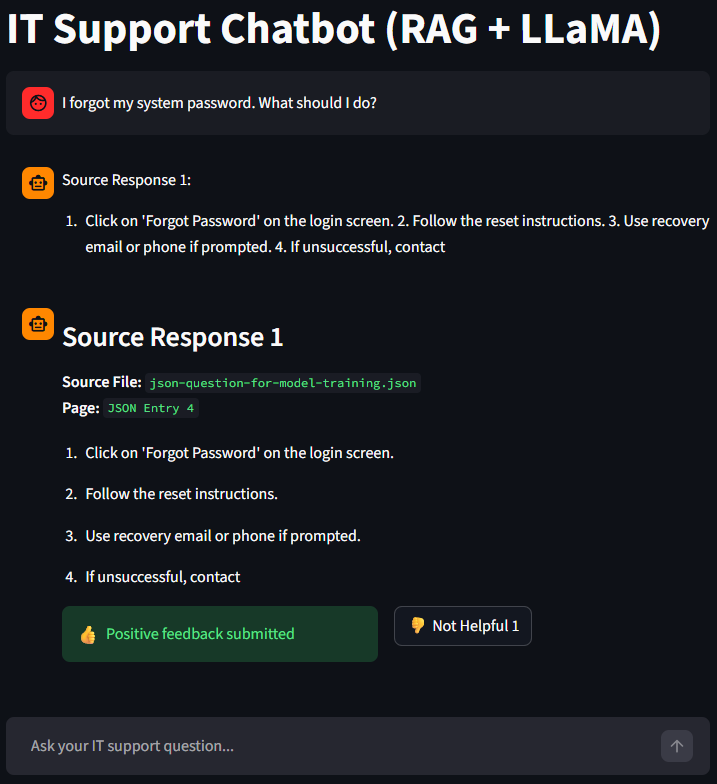
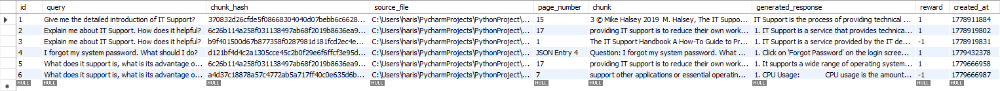

# RAG Based IT Issue Resolver Chatbot

A **RAG (Retrieval-Augmented Generation) based chatbot** designed for resolving IT-related issues using contextual knowledge and real-time data sources. The chatbot provides accurate responses with proper source references and stores user feedback for future analysis and improvement.

## User Interface

This is the chatbot interactive UI built using Streamlit.



---

## Response Feedback Table

This table stores user queries, chatbot responses, source references, and feedback for future improvements.



## Features

- 🔍 Context-aware IT issue resolution using RAG architecture
- 📚 Real-time source/data retrieval
- 📌 Provides proper references for fetched information
- 💬 Interactive chatbot UI using Streamlit
- 🗄 Stores response feedback in backend DB
- 📈 Helps improve future responses using saved feedback

---

# Project Structure

```bash
Project Folder/
│
├── RAG/
│   ├── chromaDB.py
│   ├── other chatbot files...
│
├── requirements.txt
└── README.md
```

---

# Requirements

Install Python dependencies from `requirements.txt`

## requirements.txt

```txt
streamlit
langchain
chromadb
mysql-connector-python
sentence-transformers
openai
pandas
numpy
requests
```

Install dependencies:

```bash
pip install -r requirements.txt
```

---

# Database Setup

This project uses **MySQL** for storing chatbot feedback.

Create a database:

```sql
CREATE DATABASE rag_feedback;
```

Use the database:

```sql
USE rag_feedback;
```

---

# Create Feedback Table

Create the table `response_feedback`:

```sql
CREATE TABLE IF NOT EXISTS response_feedback (
    id INT AUTO_INCREMENT PRIMARY KEY,
    query TEXT,
    chunk_hash VARCHAR(64),
    source_file TEXT,
    page_number INT,
    chunk TEXT,
    generated_response TEXT,
    reward INT,
    created_at BIGINT
);
```

---

# Database Connection Configuration

In the `RAG/chromaDB.py` file, go to **line 50** and update the credentials according to your DB setup.

```python
def get_connection():
    conn = mysql.connector.connect(
        host="127.0.0.1",
        port=3306,
        user="root",
        password="YOUR_PASSWORD",
        database="rag_feedback",
        autocommit=True
    )
```

⚠ Replace:

- `host`
- `port`
- `user`
- `password`
- `database`

with your own database credentials.

---

# How to Run

## Step 1: Setup Database
Make sure MySQL is running and the `rag_feedback` database + `response_feedback` table are created.

---

## Step 2: Configure DB Credentials
Update the database credentials inside:

```bash
RAG/chromaDB.py
```

---

## Step 3: Run the File Once
After setup, execute the file once inside your **PyCharm project environment**.

This ensures all required initialization/setup tasks are completed.

---

## Step 4: Launch Chatbot UI

Run the following command:

```bash
streamlit run RAG/chromaDB.py
```

> `RAG` is the folder inside the project directory that contains the `chromaDB.py` file.  
> If you rename or remove the folder, update the path accordingly.

---

## System Architecture

User Query → Retriever → Vector DB → Context Fetch → LLM → Response → Feedback Storage

# Access the Application

Once Streamlit starts, open it in your browser:

### Local URL
```bash
http://localhost:8501
```

### Network URL
```bash
http://192.168.29.234:8501
```

---

# How It Works

1. User enters an IT-related issue.
2. Chatbot fetches relevant context using RAG.
3. Retrieves real-time information/data.
4. Generates a contextual response.
5. Displays source/reference used for answer generation.
6. User can provide feedback.
7. Feedback is stored in backend DB for future analysis.

---

# Tech Stack

- Python
- Streamlit
- ChromaDB
- LangChain
- MySQL
- RAG Architecture
- Vector Embeddings
- Real-Time Retrieval

---

# Future Improvements

- Authentication & user login
- Admin dashboard for feedback analysis
- Response ranking system
- Fine-tuned retraining using feedback
- Multi-source knowledge ingestion

---

# Run Summary

```bash
pip install -r requirements.txt
```

```bash
streamlit run RAG/chromaDB.py
```

Open:

```bash
http://localhost:8501
```

---

## Author
**Aryan Singhal**  
📧 Email: aryansinghal705@gmail.com
💻 RAG Based IT Issue Resolver Chatbot
